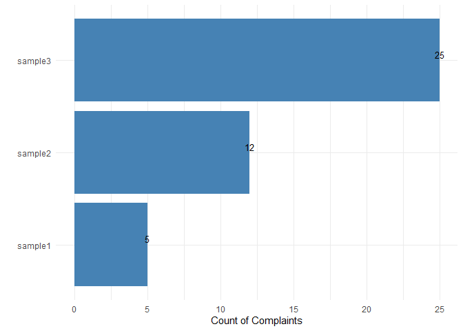
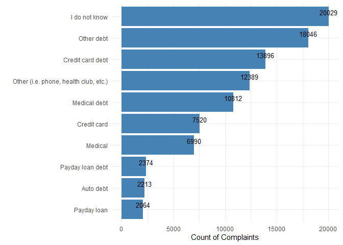
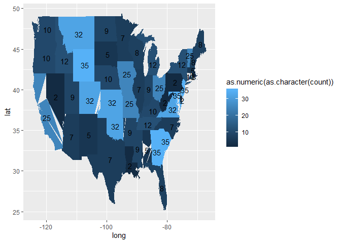
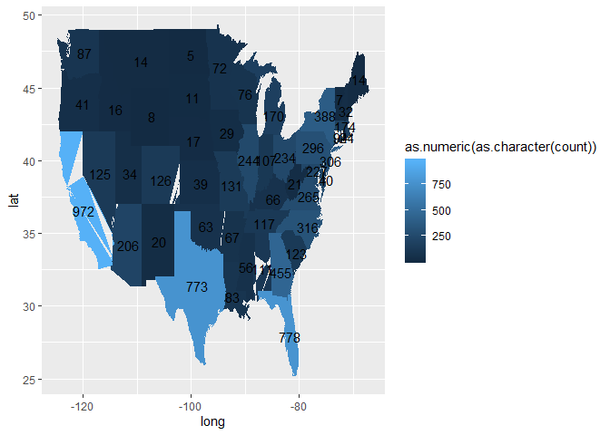

<!-- README.md is generated from README.Rmd. Please edit that file -->

# CCDB

<!-- badges: start -->

<!-- badges: end -->

The goal of CCDB is to not only make it easier for a user to acquire
data from the consumer complaints database, it also provides useful
information and summaries. It entails multiple functions that tailors
its search, and produces an output of either a dataframe or a
visualization chart/graph depending on the function. Even though all
functions are made to work on their own, some functions are better used
in combination with others.

# Vignette

Please refer to the vignette for a more complete and detailed
information about the original consumer complaints database, rationale
for the API R package, individual functions, and examples.

## Examples

``` r
library(CCDB)
#> Loading required package: qpdf

# example of product function for debt collection
product_function(product="Debt collection",subproduct_option = TRUE,state_option=TRUE)
#> [[1]]
#>                              Sub-product Count of Complaints
#> 1                          I do not know               20029
#> 2                             Other debt               18046
#> 3                       Credit card debt               13896
#> 4  Other (i.e. phone, health club, etc.)               12389
#> 5                           Medical debt               10812
#> 6                            Credit card                7520
#> 7                                Medical                6990
#> 8                       Payday loan debt                2374
#> 9                              Auto debt                2213
#> 10                           Payday loan                2064
#> 11                         Mortgage debt                1457
#> 12             Federal student loan debt                1090
#> 13                                  Auto                1064
#> 14             Private student loan debt                1052
#> 15                              Mortgage                 907
#> 16              Non-federal student loan                 684
#> 17                  Federal student loan                 549
#> 
#> [[2]]
#>                                   State Count of Complaints
#> 1                                    CA               12407
#> 2                                    TX               12220
#> 3                                    FL               10606
#> 4                                    GA                6279
#> 5                                    NY                4354
#> 6                                    IL                3591
#> 7                                    OH                3590
#> 8                                    PA                3330
#> 9                                    NC                3142
#> 10                                   NJ                2915
#> 11                                   VA                2657
#> 12                                   AZ                2573
#> 13                                   MI                2505
#> 14                                   MD                2484
#> 15                                   TN                2353
#> 16                                   SC                2016
#> 17                                   WA                1844
#> 18                                   MO                1680
#> 19                                   LA                1647
#> 20                                   CO                1631
#> 21                                   NV                1592
#> 22                                   AL                1473
#> 23                                   IN                1463
#> 24                                   MA                1345
#> 25                                   MN                 978
#> 26                                   WI                 971
#> 27                                   KY                 911
#> 28                                   OR                 902
#> 29                                   OK                 881
#> 30                                   UT                 840
#> 31                                   CT                 796
#> 32                                   MS                 717
#> 33                                   KS                 678
#> 34                                   AR                 659
#> 35                                   NM                 453
#> 36                                   DE                 440
#> 37                                   DC                 425
#> 38                                   IA                 419
#> 39                                   NE                 372
#> 40                                   ID                 362
#> 41                                   HI                 307
#> 42                                   NH                 305
#> 43                                   ME                 279
#> 44                                   WV                 243
#> 45                                   RI                 232
#> 46                                   MT                 213
#> 47                                   PR                 171
#> 48                                   SD                 171
#> 49                                   AK                 143
#> 50                                   ND                 141
#> 51                                   WY                 101
#> 52                                   VT                  67
#> 53                                   AP                  30
#> 54                                   AE                  28
#> 55                                   FM                  16
#> 56                                   GU                  10
#> 57                                   VI                   9
#> 58 UNITED STATES MINOR OUTLYING ISLANDS                   5
#> 59                                   AS                   2

#example of general function for Bank of America, National Association
general_function(company = "BANK OF AMERICA, NATIONAL ASSOCIATION",product = "Checking or savings account",issue="Managing an account", limit=10)
#>    Complaint ID                    Associated Company
#> 1       2495291 BANK OF AMERICA, NATIONAL ASSOCIATION
#> 2       3337131 BANK OF AMERICA, NATIONAL ASSOCIATION
#> 3       2828780 BANK OF AMERICA, NATIONAL ASSOCIATION
#> 4       3248284 BANK OF AMERICA, NATIONAL ASSOCIATION
#> 5       3125435 BANK OF AMERICA, NATIONAL ASSOCIATION
#> 6       2880265 BANK OF AMERICA, NATIONAL ASSOCIATION
#> 7       2911902 BANK OF AMERICA, NATIONAL ASSOCIATION
#> 8       2697664 BANK OF AMERICA, NATIONAL ASSOCIATION
#> 9       2944593 BANK OF AMERICA, NATIONAL ASSOCIATION
#> 10      3001304 BANK OF AMERICA, NATIONAL ASSOCIATION
#>                        Product      Sub-Product               Issue
#> 1  Checking or savings account Checking account Managing an account
#> 2  Checking or savings account Checking account Managing an account
#> 3  Checking or savings account Checking account Managing an account
#> 4  Checking or savings account Checking account Managing an account
#> 5  Checking or savings account Checking account Managing an account
#> 6  Checking or savings account Checking account Managing an account
#> 7  Checking or savings account Checking account Managing an account
#> 8  Checking or savings account Checking account Managing an account
#> 9  Checking or savings account Checking account Managing an account
#> 10 Checking or savings account Checking account Managing an account
#>                                       Sub-Issue  Date Sent
#> 1                      Deposits and withdrawals 2017-05-26
#> 2                      Deposits and withdrawals 2019-08-12
#> 3             Problem using a debit or ATM card 2018-02-28
#> 4                      Deposits and withdrawals 2019-05-20
#> 5             Problem using a debit or ATM card 2019-01-15
#> 6                      Deposits and withdrawals 2018-04-19
#> 7                      Deposits and withdrawals 2018-05-19
#> 8                      Deposits and withdrawals 2017-10-10
#> 9  Funds not handled or disbursed as instructed 2018-06-24
#> 10                     Deposits and withdrawals 2018-08-29
#>    Consumer Consent Date Received State Zipcode
#> 1  Consent provided    2017-05-26    VA   222XX
#> 2  Consent provided    2019-08-12    IL   600XX
#> 3  Consent provided    2018-02-28    CT      NA
#> 4  Consent provided    2019-05-20    TX   774XX
#> 5  Consent provided    2019-01-15    NY   100XX
#> 6  Consent provided    2018-04-19    NY   114XX
#> 7  Consent provided    2018-05-19    NY   125XX
#> 8  Consent provided    2017-10-10    IN      NA
#> 9  Consent provided    2018-06-24    NC   276XX
#> 10 Consent provided    2018-08-24    NC   271XX
#>                                                                                                                                                                                                                                                                                                                                                                                                                                                                                                                                                                                                                                                                                                                                                                                                                                                                                                                                                                                                                                                                                                                                                                                                                                                                                                                                                                                                                                                                                                                                                                                                                                                                                                                                                                                                                                                                                                                                                                                                                                                                                                                                                                                                                                                                                                                                                                                                                                                                                                                                                                                                                                                                                                                                                                                                                                                                                                                                                                                                                                                                                                                                                                                                                                                                                                                                                                                                                                                                                                                                                                                                                                                                                                                                                                                                                                                                                                                                                                                                                                                                                                                                                                                                                                                                                                                                                                                                                                                                                                                                                                                                                                                                                                           Complaint Narrative
#> 1                                                                                                                                                                                                                                                                                                                                                                                                                                                                                                                                                                                                                                                                                                                                                                                                                                                                                                                                                                                                                                                                                                                                                                                                                                                                                                                                                                                                                                                                                                                                                                                                                                                                                                                                                                                                                                                                                                                                                                                                                                                                                                                                                                                                                                                                                                                                                                                                                                                                                                                                                                                                            Bank of America has made it very difficult to access funds direct-deposited into my checking account. I recently had to travel across the country to deal with a family death, and wanted to move some funds to a credit union I 've been a member of for decades. That way I could avoid traveling with a large amount of cash, and would have access to the funds at a familiar location at my destination. My first plan was to write a check on my Bank of America account and deposit it to my credit union, in time for it to clear before my arrival. However, BANK OF AMERICA HAS NEVER SENT ME A SET OF CHECKS FOR THIS ACCOUNT. I am perplexed as to how a " checking account '' does not come with checks. Next I looked into transferring funds, but Bank of America charges {$3.00} to transfer funds to another institution. I have never encountered such a fee. As I prepared to leave town, I started to panic that I would not have money when I got there. Finally, going through all my new-account materials, I found one single temporary check that looked fake and unofficial, and used it for lack of other options. Meanwhile, I did n't realize that my wife tried to help me out of the stressful situation by withdrawing from a Bank of America ATM near her office, and deposited the cash into our credit union immediately before I left. Had I known that day, I would have stopped the temporary check, but I did n't know we had duplicated efforts for a day or two. The temporary check bounced and Bank of America assessed a {$35.00} fee for the returned check. When we discovered the problem we immediately made a big deposit into the Bank of America account to cover it and ensure the account is in good status. Then I contacted Bank of America to explain how it occurred, and asked them to waive the fee. The Bank refused, and still has not sent me pre-printed checks for this checking account. Bank of America seems to set its customers up for failure by making it difficult to transact without fees. So I am asking the CFPB 's help. Thank you.
#> 2                                                                                                                                                                                                                                                                                                                                                                                                                                                                                                                                                                                                                                                                                                                                                                                                                                                                                                                                                                                                                                                                                                                                                                                                                                                                                                                                                                                                                                                                                                                                                                                                                                                                                                                                                                                                                                                                                                                                                                                                                                                                                                                                                                                                                                                                                                                                                                                                                                                                                                                                                                                                                                                                                                                                                                                                                                                                                                                                                                                                                                                                                                                                                                                                                                            I have been banking with bank of AMerica for a while now and i have been receiving direct deposits and my paycheck goes into that account. I received some funds which i needed to withdraw however bank of america placed my account on hold to investigate the transaction. I have no issues with that as it was legitimate and also explained why it was sent. I have cooperated with all their investigations/requests etc which supposedly only takes 3 to 5 business days. Unfortunately while the hold was placed on my account my paycheck was paid in. After the 5th business day i contacted the bank and i was told to wait 30 more days to make matters worse i was told to " make other arrangements ''. How exactly was i suposed to do that? How will i pay my rent? My bills? I explained this to them but they said they can not do anything, asked they just give me the paycheck while they do their investgation but they said whilst its ongoing they are unable to do anything. I have never, in my 10 year credit history, missed a credit card payment, unfortunately due to my account been frozen, i will be inccuring a non-payment report. I am extremely frustrated, worst part is no one is able to give me an answer as to what is going on, when i ask to speak with the department doing the investigation i am told they are an unknown entity that does not have a phone number. Please help before i am evicted amongst several other things
#> 3                                                                                                                                                                                                                                                                                                                                                                                                                                                                                                                                                                                                                                                                                                                                                                                                                                                                                                                                                                                                                                                                                                                                                                                                                                                                                                                                                                                                                                                                                                                                                                                                                                                                                                                                                                                                                                                                                                                                                                                                                                                                                                                                                                                                                                                                                                                                                                                                                                                                                                                                                                                                                                                                                                                                                                                                                                                                                                                                                                                                                                                                                                                                                                                                                                                                                                                                                                                                                                                                                                                   on XX/XX/2017 I filed a complaint with Bank of America after there was a fraudulent transaction was made on my account in which {$350.00} were withdrawn through a teller transaction that occurred on that same day. I explained to the fraud and claims department that I had visited XXXX XXXX XXXXXXXX the weekend prior and I had visited several businesses where i used the card and had also utilized an ATM. I did however still have the card in my possession. After investigating, Bank of America chose to deny my claim saying that both a debit card and correct pin were used ( even though i still had the original card in my hand at the time of the fraudulent transaction ). I appealed the decision and by XXXX my appeal was denied once again. After looking through various governmet resources and statues, it seems that my situation warranted for me to only be liable for a maximum of {$50.00}, however, Bank of America has chosen to ignore their responsibilities in keeping their customers data and financial holdings secure by allowing the illegal and fraudulent copy of a debit card to be used in a teller transaction without any form of scrutiny whatsoever.
#> 4                                                                                                                                                                                                                                                                                                                                                                                                                                                                                                                                                                                                                                                                                                                                                                                                                                                                                                                                                                                                                                                                                                                                                                                                                                                                                                                                                                                                                                                                                                                                                                                                                                                                                                                                                                                                                                                                                                                                                                                                                                                                                                                                                                                                                                                                                                                                                                                                                                                                                                                                                                                                                                                                                                                                                                                                                                                                                                                                                                                                                                                                                                                                                                                                                                                                                                                                                                                                                                                                                                                                                                                                                 XX/XX/XXXX my bank of america account was hacked. I quickly received an email regarding low funds and contacted my bank. They did nothing but tell me they would research the issue and would take 10 days to come to a decision. Today I received notice that my claim was denied because the transactions in question were completed by a third party who was given access to your account or account information. I've never ever given my information to anyone to steal my money. They told me today that if I get a letterhead from an IT or XXXX XXXX company stating that my laptop was compromised that they would revisit my account. I spoke to an IT professional and they said that wont prove anything. The bank has IP addresses of whoever logged in and they can trace it. The bank has not done anything to find who did this. There was proof that someone made multiple payments to XXXX with account numbers and they told me they dont contact them??? I was furious! Said so what are you doing for me then?!!! There is evidence where my money went and they did nothing about it!
#> 5  Summary : A fraudster illegally withdrew {$4500.00} from my checking account at a Bank of America teller ( in person, according to Bank of America ) at a branch in XXXX   XXXX  XXXX. I live ~80 blocks away from this branch, and have a BofA branch within 5 minutes of my home. I have no reason to go to the branch in question. \n\nI filed a claim with Bank of America, who denied the claim on the following grounds : AUTOMATIC DENIAL because a pin and card were verified. I asked for a review of the decision and specifically asked them to check the video footage of the withdrawal. I also filed a police report with the XXXX and provided the police report number to Bank of America. After receiving this information, they denied the claim again, stating the same reason automatic denial because a pin and card were verified. \n\nThe check fraud department confirmed to me that the video evidence had not been reviewed and the bank is refusing to review the video, stating We refuse to pull the video. Our policy requires that we ONLY PULL VIDEO FOR CLAIMS OVER {$5000.00}. There is nothing further we can do for you. \n\nI would like to receive back the {$4500.00} that was stolen from my account. Why does Bank of America allow fraud to go unchecked if its under {$5000.00}? \n\nA detailed timeline of events is below. \n\nXX/XX/XXXX I noticed a withdrawal of {$4500.00} on my online banking account. Neither my wife nor I had lost our debit cards or our PINs, and we had been home all day. I immediately called Bank of America to report the issue. Since the transaction was still pending they said I needed to call back after it cleared the next day. \n\nXX/XX/XXXX I called back and filed a formal claim. Bank of America said it would take ~3 months to review the claim, but did not provide any funds during the review. I was forced to bear the burden of the loss throughout the process. \n\nXX/XX/XXXX XX/XX/XXXX I called the check fraud department several times to check on the status and ask if any further information was needed. Nothing further was requested and no update was provided other than to say the bank still has more time to review the claim. \n\nXX/XX/XXXX I was notified that the claim was denied on the following grounds : automatic denial because a pin and card were verified. I explained to the check fraud department that the card was cloned and the PIN could have been obtained via a skimmer device. \n\nI asked if the video footage of the withdrawal was reviewed, which would be a very simple way of conducting the investigation. The agent told me that it was not clear that the video had been reviewed, but that she would escalate the review of the decision and add a note to my account my request to review the video footage of the withdrawal. \n\nAgent stated it would take another ~1 month to conduct the review of the decision. \n\nMid XX/XX/XXXX I called to check in on the status of the claim. I received no update. \n\nThe agent asked if I filed a police report and I said I had not because I wasnt told it would be required. Further, the police have no bearing on whether the bank reimburses me. I was told now ( for the first time ) that the police report is a critical part of the bank 's investigation and would go a long way to resolve the claim. I said I was happy to file a police report if that would help. \n\nXX/XX/XXXX I had left town for the holidays, but immediately upon my return, I visited the XXXX precinct and filed a formal police report. I provided this information, including the police report number, to BofA immediately. I was told the review was ongoing. \n\nXX/XX/XXXX I called BofA again because I had not received any communication from them regarding the review. I was told the claim had been denied for the same reason automatic denial because a pin and card were verified. \n\nI asked the check fraud department agent if the video footage had been reviewed. The agent told me that the video had not been reviewed but that she would ask the analyst reviewing the claim whether they could pull and review the footage while I waited on hold. After 5 minutes, she came back on the phone to tell me the analyst has refused to pull the video. BofAs policy only requires video evidence be pulled for claims over {$5000.00}. There is nothing more we can do for you. \n\nI informed the XXXX, which stated that this has happened multiple times with Bank of America. In other situations, they actually obtained photographic evidence of the perpetrator and BofA still denied the claim.
#> 6                                                                                                                                                                                                                                                                                                                                                                                                                                                                                                                                                                                                                                                                                                                                                                                                                                                                                                                                                                                                                                                                                                                                                                                                                                                                                                                                                                                                                                                                                                                                                                                                                                                                                                                                                                                                                                                                                                                                                                                                                                                                                                                                                                                                                                                                                                                                                                                                                                                                                                                                                                                                                                                                                                                                                                                                                                                                                                                                                                                                                                                                                                                                                                                                                                                                                                                                                                                                                                                                                                                                                                                                                                                                                                                                                                         I deposited a USPS money order last month into my Bank of America account and it was held for 9 days. It cleared eventually but I was charged service charges on items that automatically come out of my account based on this same check clearing every month in a timely manner. There was no reason to hold this money order when I told rep to check the past and see that I make this deposit every month. Nothing was done. I have been a customer of BOA for over 20 years. As a courtesy they should have released the deposit. \n\nbOA rep told me that the payer had put a hold on the check, this statement was not true. I have deposited the same check for over 3 years into my BOA acct, with no holds. \n\nI deposited another check yesterday I received, from a large MAJOR legitimate insurance company and BOA is holding this check, unnecessarily. I feel that this is obviously an unfair subjective practice based on race.
#> 7                                                                                                                                                                                                                                                                                                                                                                                                                                                                                                                                                                                                                                                                                                                                                                                                                                                                                                                                                                                                                                                                                                                                                                                                                                                                                                                                                                                                                                                                                                                                                                                                                                                                                                                                                                                                                                                                                                                                                                                                                                                                                                                                                                                                                                                                                                                                                                                                                                                                                                                                                                                                                                                                                                                                                                                                                                                                                                                                                                                                                                                                                                                                                                                                                                                                                                                                                                                                                                                                                                                                                                                                                                                                                                                                                                                                                                                                                                                                                                  XX/XX/XXXX I deposited a check last night from my husbands bank to my bank, this bank is holding my check until XX/XX/XXXX, thats 12 days away and they are refusing to release my funds.I put in a check for $ XXXX.Three weeks ago I put the same check in for {$1000.00} and they had no problem realeasing the money then.Its illegal for them to hold money especially when we just got hit with a major storm and we lost all our food.They dont wan na heat anything they just keep telling me they refuse to release it.I will be closing this account ASAP after my money is cleared.This check already released the money from the other account into my account thats why we are so upset.They do this all the time! Horrible customer service.
#> 8                                                                                                                                                                                                                                                                                                                                                                                                                                                                                                                                                                                                                                                                                                                                                                                                                                                                                                                                                                                                                                                                                                                                                                                                                                                                                                                                                                                                                                                                                                                                                                                                                                                                                                                                                                                                                                                                                                                                                                                                                                                                                                                                                                                                                                                                                                                                                                                                                                                                                                                                                                                                                                                                                                                                                                                                                                                                                                                                                                                                                                                                                                                                                                                                                                                                                                                                                                                                                                                                                                                                                                                                                                                                                                                        I deposited a Business Check written to myself for the amount of {$700.00} on XXXX XXXX XXXX. I received written notice that my deposit would be released on XXXX XXXX XXXX. As Such, the money was released into my account but then removed from my account immediately. Then another letter came and said my deposit would be held until XXXX XXXX XXXX due to the funds possibly not being in the account. I just spoke with the bank that the check was written on, XXXX XXXX, and they confirmed the check cleared their bank on XXXX XXXX XXXX. This hold has caused me to be late on my rent, my cable and my internet payments. Causing over {$100.00} in late fees that I will now have to pay because Bank of America will not release the hold on my account until XXXX XXXX XXXX. \n\nPLease help me get this resolved as Bank of Ameria will not release the hold. I have tried speaking with them and I wll be calling them back again. \n\nThank You XXXX XXXX XXXX XXXX XXXX Client
#> 9                                                                                                                                                                                                                                                                                                                                                                                                                                                                                                                                                                                                                                                                                                                                                                                                                                                                                                                                                                                                                                                                                                                                                                                                                                                                                                                                                                                                                                                                                                                                                                                                                                                                                                                                                                                                                                                                                                                                                                                                                                                                                                                                             Good Morning, My name is XXXX XXXX and I have been a customer of Bank Of America for over 20 years. Recently I called them to report fraud that had occurred on my account. They immediately told me they were going to freeze my account, have their fraud department investigate, and told me I needed to visit a local branch to open a new account and have my money transferred over. I followed all their steps and waited 2 weeks to get a response back from them regarding my fraud case. When I called to inquire about it they kept telling me to go to my local branch because they were having issues. I visited the branch at least 3 times during my workday and got the run around multiple times. After 2 weeks I got a phone call while I was at work from the Bank Of America fraud department that my claim was being denied because there was no fraud and that they would send me more information about the investigation. Not once in 2 weeks did they attempt to call me to get additional information about my account and what actually happened. They decided to close my case without gathering all the information and when I tried to call them they hung up on my at least 3 times. I asked for supervisors multiple times and yet they refused to connect me. Then they told me they would call me back with answers with 48 hours and they never did that. I decided to visit the local branch again and see if they could help. They called the fraud department and told them the same information about how they were going to call me back and get the investigator on the phone. That never happened. All these calls are recorded and I had to talk to at least 20 different people and explain the situation over and over again. On top of that my money was being held up by Bank Of America and fees were being assessed because they had locked my account. Also someone from the internal bank had changed my account user id and password without my consent. And each time I inquired about that no one at the bank could answer my question on who did it. This situation had been a total nightmare all while my money is still at the bank and I have no answers on how the fraud happened. They have treated me like XXXX, lied multiple times, and refused service. This is unacceptable and I had no choice but to file a complaint and escalate this. I'm hoping you guys can force them to do their job and stop giving me the run around. They messed up this entire situation and my account. I will not let this go!
#> 10                                                                                                                                                                                                                                                                                                                                                                                                                                                                                                                                                                                                                                                                                                                                                                                                                                                                                                                                                                                                                                                                                                                                                                                                                                                                                                                                                                                                                                                                                                                                                                                                                                                                                                                                                                                                                                                                                                                                                                                                                                                                                                                                                                                                                                                                                                                                                                                                                                                                                                                                                                                                                                                                                                                                                                                                                                                                                                                                                                                                                                                                                                                                                                                                                                                                                                                                                                                                                                                                                                                                                                                                                                                                                                                                                                                                                                                                                                                                                                                                                                                                                                                                                                                                                                                                                                                                                                                                                                                                                                                                                                                                                                                     Bank of America Fraud dept has denied me temporary credit of {$210.00}
#>                                                                            Public Company Response
#> 1  Company has responded to the consumer and the CFPB and chooses not to provide a public response
#> 2  Company has responded to the consumer and the CFPB and chooses not to provide a public response
#> 3  Company has responded to the consumer and the CFPB and chooses not to provide a public response
#> 4  Company has responded to the consumer and the CFPB and chooses not to provide a public response
#> 5  Company has responded to the consumer and the CFPB and chooses not to provide a public response
#> 6  Company has responded to the consumer and the CFPB and chooses not to provide a public response
#> 7  Company has responded to the consumer and the CFPB and chooses not to provide a public response
#> 8  Company has responded to the consumer and the CFPB and chooses not to provide a public response
#> 9  Company has responded to the consumer and the CFPB and chooses not to provide a public response
#> 10 Company has responded to the consumer and the CFPB and chooses not to provide a public response
#>                   Company Response Timely Consumer Disputed
#> 1      Closed with monetary relief    Yes               N/A
#> 2          Closed with explanation    Yes               N/A
#> 3      Closed with monetary relief    Yes               N/A
#> 4      Closed with monetary relief    Yes               N/A
#> 5          Closed with explanation    Yes               N/A
#> 6          Closed with explanation    Yes               N/A
#> 7  Closed with non-monetary relief    Yes               N/A
#> 8          Closed with explanation    Yes               N/A
#> 9          Closed with explanation    Yes               N/A
#> 10     Closed with monetary relief    Yes               N/A

#example of visualization tool using sample df
visualization_tool_function()
```



``` r

#example of visualization tool using the outputs of company function for BANK OF THE WEST
example1<- product_function(product="Debt collection")
#using the subproduct category dataframe from the output
visualization_tool_function(example1[1],limit=10)
```



``` r

#example of heatmap state visualization tool using sample df
heatmap_state_function()
```



``` r

#using the output of product function for Student loan
example2 <- product_function(product="Vehicle loan or lease")

#selecting the second dataframe, as that is the one with the state attributes and values
heatmap_state_function(example2[2])
```


